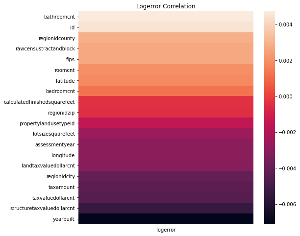
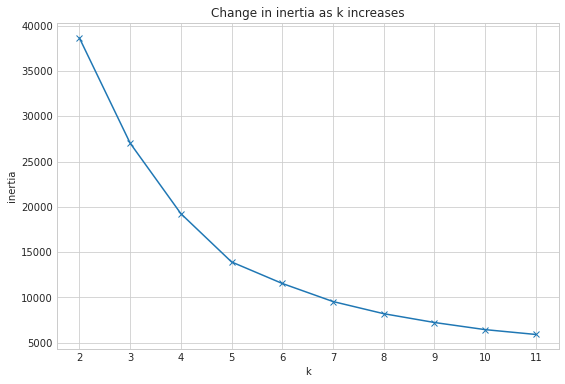
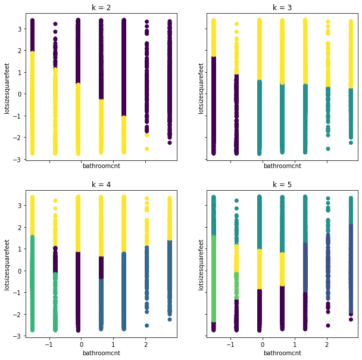
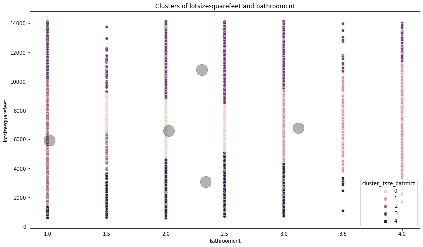
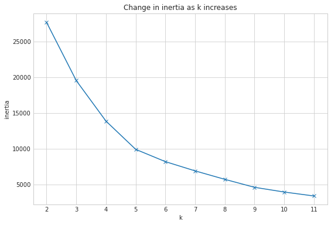
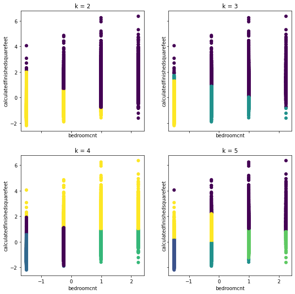
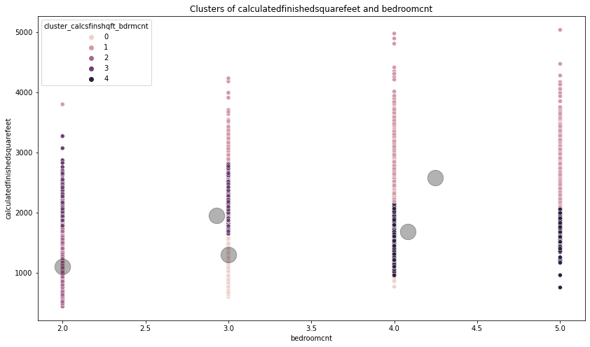
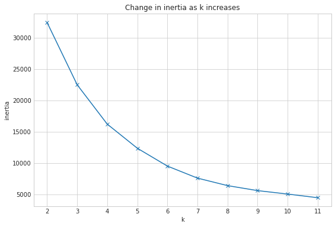
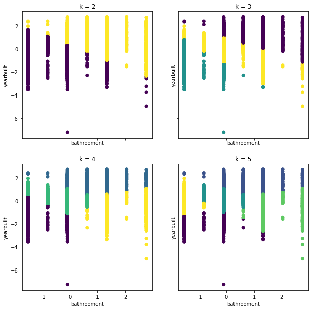
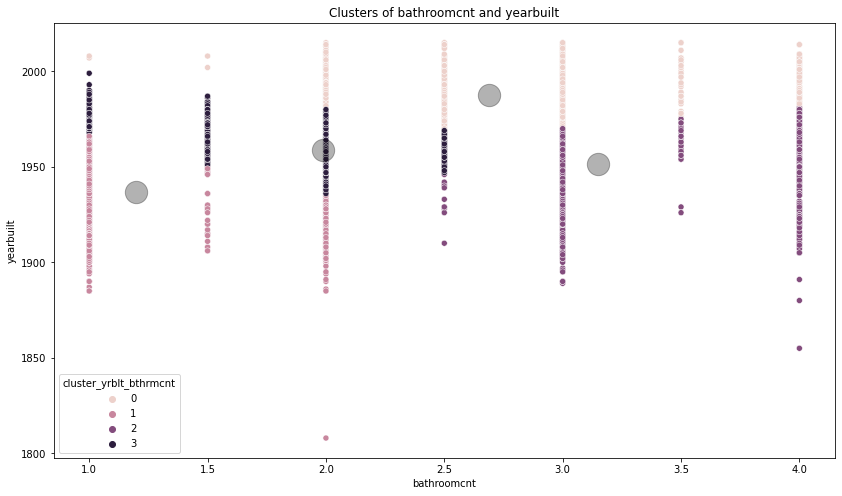

<h1>Zillow: What is driving the error is the Zestimates?</h1>

# Table of Contents 
1. [Project Planning](#project_planning)
    1. [Project Objectives](#project_objectives)
    2. [Business Goals](#business_goals)
    3. [Audience](#audience)
    4. [Deliverables](#deliverables)
2. [Executive Summary](#exe_sum)
3. [Acquire Data](#acquire)
    1. [Data Dictonary](#data_dict)
    2. [Data Description](#data_desc)
    3. [Acquire Takeaways](#acquire_takeaways)
4. [Prepare Data](#prep_data)
    1. [Distributions](#distributions)
    2. [Prepare Takeaways](#prepare_takeaways)
5. [Data Exploration](#explore)
    1. [Correlations](#correlations)
    2. [Pairplot](#pairplot)
    3. [Explore Takeaways](#explore_takeaways)
6. [Hypothesis](#hypothesis)
    2. [Conclusion](#hyp_conclusion)
7. [Modeling & Evaluation](#modeling)
    7. [Conclusions & Next Steps](#conclusions)

## Project Planning
✓ 🟢 **Plan** ➜ ☐ _Acquire_ ➜ ☐ _Prepare_ ➜ ☐ _Explore_ ➜ ☐ _Model_ ➜ ☐ _Deliver_

### Project Objectives 
> - For this project you will continue working with the zillow dataset. Continue to use the 2017 properties and predictions data for single unit / single family homes.
> - In addition to continuing work on your previous project, you should incorporate clustering methodologies on this project.
> - Any abstracted modules that are created to make the presentation more clean, during the acquistion and preparation of data.
> - The presentation will consist of a notebook demo of the discoveries you made and work you have done related to uncovering what the drivers of the error in the zestimate is.

### Business Goals 
> - Create models that are better at predicting property values than the baseline.
> - Demonstrate model effeciency utilizing hyperparameters and different algorithms to estimate price.
> - Document your process well enough to be presented or read like a report.

### Audience 
> - Your audience for this project is a data science team. 

### Deliverables
> - A clearly named final notebook. This notebook will be what you present and should contain plenty of markdown documentation and cleaned up code.
> - A README that explains what the project is, how to reproduce you work, and your notes from project planning.
> - A Python module or modules that automate the data acquisistion and preparation process. These modules should be imported and used in your final notebook.

<a href='#toc'>Table of Contents</a>

## Executive Summary

### Goals
> - Utilize at least 3 clustering associations and 4 models to discover potential drivers of the `logerror` of the Zillow Zestimate for single-unit properties sold during 2017. 
> - Abstract the functions to sub python scripts to have a clean presentation.
> - Ensure the project is easily reproducable 

### Findings
> - All (4) hypotheses rejected the Null Hypotheses

<a href='#toc'>Table of Contents</a>

## Acquire Data
✓ _Plan_ ➜ 🟢 **Acquire** ➜ ☐ _Prepare_ ➜ ☐ _Explore_ ➜ ☐ _Model_ ➜ ☐ _Deliver_

### Total Missing Values
> - There are 7016 missing values.

### DataFrame Head
|    |   id |   bathroomcnt |   bedroomcnt |   calculatedfinishedsquarefeet |   fips |    latitude |    longitude |   lotsizesquarefeet |   propertylandusetypeid |   rawcensustractandblock |   regionidcity |   regionidcounty |   regionidzip |   roomcnt |   yearbuilt |   structuretaxvaluedollarcnt |   taxvaluedollarcnt |   assessmentyear |   landtaxvaluedollarcnt |   taxamount |    logerror | transactiondate   | last_trans_date   |
|---:|-----:|--------------:|-------------:|-------------------------------:|-------:|------------:|-------------:|--------------------:|------------------------:|-------------------------:|---------------:|-----------------:|--------------:|----------:|------------:|-----------------------------:|--------------------:|-----------------:|------------------------:|------------:|------------:|:------------------|:------------------|
|  0 |   10 |             4 |            4 |                           3095 |   6037 | 3.42912e+07 | -1.18578e+08 |                 nan |                     269 |              6.03711e+07 |          12447 |             3101 |         96356 |         0 |        2016 |                       138760 |              192544 |             2016 |                   53784 |     2460.72 |  0.00596317 | 2017-01-02        | 2017-01-02        |
|  1 |   20 |             2 |            4 |                           3633 |   6037 | 3.456e+07   | -1.1817e+08  |                9826 |                     261 |              6.03791e+07 |          40227 |             3101 |         97329 |         0 |        2005 |                       222321 |              296425 |             2016 |                   74104 |     6941.39 |  0.0424629  | 2017-01-02        | 2017-01-02        |
|  2 |   28 |             4 |            5 |                           2865 |   6037 | 3.38792e+07 | -1.18361e+08 |                4990 |                     246 |              6.03762e+07 |          33612 |             3101 |         96124 |         0 |        1972 |                       271704 |              831224 |             2016 |                  559520 |    10455.4  |  0.20647    | 2017-01-02        | 2017-01-02        |
|  3 |   30 |             2 |            2 |                           1090 |   6037 | 3.39741e+07 | -1.18423e+08 |               40247 |                     266 |              6.03728e+07 |          12447 |             3101 |         96072 |         0 |        2004 |                       232897 |              357568 |             2016 |                  124671 |     6165.36 |  0.0218525  | 2017-01-02        | 2017-01-02        |
|  4 |   31 |             4 |            3 |                           1620 |   6037 | 3.39962e+07 | -1.18438e+08 |                 nan |                     261 |              6.03727e+07 |          12447 |             3101 |         96047 |         0 |        2011 |                       339532 |              847770 |             2016 |                  508238 |    10244.9  | -0.0195456  | 2017-01-02        | 2017-01-02        |

### DataFrame Info
|    | column_name                  |   nulls | dtypes   |
|---:|:-----------------------------|--------:|:---------|
|  0 | id                           |       0 | int64    |
|  1 | bathroomcnt                  |       0 | float64  |
|  2 | bedroomcnt                   |       0 | float64  |
|  3 | calculatedfinishedsquarefeet |       0 | float64  |
|  4 | fips                         |       0 | float64  |
|  5 | latitude                     |       0 | float64  |
|  6 | longitude                    |       0 | float64  |
|  7 | lotsizesquarefeet            |    5242 | float64  |
|  8 | propertylandusetypeid        |       0 | float64  |
|  9 | rawcensustractandblock       |       0 | float64  |
| 10 | regionidcity                 |    1331 | float64  |
| 11 | regionidcounty               |       0 | float64  |
| 12 | regionidzip                  |     159 | float64  |
| 13 | roomcnt                      |       0 | float64  |
| 14 | yearbuilt                    |      71 | float64  |
| 15 | structuretaxvaluedollarcnt   |      99 | float64  |
| 16 | taxvaluedollarcnt            |       6 | float64  |
| 17 | assessmentyear               |       0 | float64  |
| 18 | landtaxvaluedollarcnt        |       6 | float64  |
| 19 | taxamount                    |     102 | float64  |
| 20 | logerror                     |       0 | float64  |
| 21 | transactiondate              |       0 | object   |
| 22 | last_trans_date              |       0 | object   |

### DataFrame Description
|                              |   count |             mean |            std |             min |              25% |              50% |              75% |              max |
|:-----------------------------|--------:|-----------------:|---------------:|----------------:|-----------------:|-----------------:|-----------------:|-----------------:|
| id                           |   74244 |  38818.9         |  22348.2       |    10           |  19509.8         |  38762.5         |  58051.2         |  77613           |
| bathroomcnt                  |   74244 |      2.31222     |      1.00148   |     1           |      2           |      2           |      3           |     20           |
| bedroomcnt                   |   74244 |      3.22232     |      1.11993   |     1           |      3           |      3           |      4           |     25           |
| calculatedfinishedsquarefeet |   74244 |   1808.71        |    932.876     |   352           |   1221           |   1581           |   2141           |  26345           |
| fips                         |   74244 |   6048.26        |     20.7975    |  6037           |   6037           |   6037           |   6059           |   6111           |
| latitude                     |   74244 |      3.401e+07   | 243665         |     3.33394e+07 |      3.38344e+07 |      3.40202e+07 |      3.4173e+07  |      3.48069e+07 |
| longitude                    |   74244 |     -1.18215e+08 | 350619         |    -1.19448e+08 |     -1.18411e+08 |     -1.18186e+08 |     -1.17956e+08 |     -1.17556e+08 |
| lotsizesquarefeet            |   69002 |  23335.3         | 118135         |   343           |   5725           |   7013           |   9929.75        |      6.97101e+06 |
| propertylandusetypeid        |   74244 |    261.186       |      4.20089   |   246           |    261           |    261           |    261           |    275           |
| rawcensustractandblock       |   74244 |      6.04857e+07 | 206474         |     6.0371e+07  |      6.0373e+07  |      6.03757e+07 |      6.05904e+07 |      6.11101e+07 |
| regionidcity                 |   72913 |  35415.8         |  52702.3       |  3491           |  12447           |  25218           |  45457           | 396556           |
| regionidcounty               |   74244 |   2582.35        |    779.163     |  1286           |   2061           |   3101           |   3101           |   3101           |
| regionidzip                  |   74085 |  96558.9         |   3878.66      | 95982           |  96186           |  96378           |  96974           | 399675           |
| roomcnt                      |   74244 |      1.55885     |      2.91192   |     0           |      0           |      0           |      0           |     86           |
| yearbuilt                    |   74173 |   1964.63        |     23.3592    |  1808           |   1950           |   1963           |   1982           |   2016           |
| structuretaxvaluedollarcnt   |   74145 | 176088           | 208736         |    10           |  79918           | 129628           | 206239           |      1.04024e+07 |
| taxvaluedollarcnt            |   74238 | 437283           | 540462         |     9           | 192496           | 324583           | 515000           |      3.01668e+07 |
| assessmentyear               |   74244 |   2016           |      0.0416688 |  2014           |   2016           |   2016           |   2016           |   2016           |
| landtaxvaluedollarcnt        |   74238 | 261416           | 381454         |     9           |  79264           | 175816           | 324549           |      1.97645e+07 |
| taxamount                    |   74142 |   5358.7         |   6232.73      |    20.24        |   2542.71        |   4064.68        |   6239.65        | 342940           |
| logerror                     |   74244 |      0.0168669   |      0.171047  |    -4.65542     |     -0.0242413   |      0.00674558  |      0.0394171   |      5.263       |

### Takeaways from Acquire:

> - Target variable: `logerror`
> - This dataframe has 74,244 rows and 23 columns
> - The dataset has 162,235 missing values
> - There are 2 `object` based dtypes.

<a href='#toc'>Table of Contents</a>

## Prepare Data
✓ _Plan_ ➜ ✓ _Acquire_ ➜ 🟢 **Prepare** ➜ ☐ _Explore_ ➜ ☐ _Model_ ➜ ☐ _Deliver_
> - Utilized standard median fillna values method.
> - Filtered for outliers above a `taxamount` of $5,000,000 and `bedroomcnt` & `bathroomcnt` greater than 1.
> - Further scaled the data to min max values.

### Prepare Takeaways
> - The data is now prepared to be input into the explore aspects of the data pipeline to evaluate what features we should use to potentially cluster.
> - We dropped all other columns that had a high quantity of null values.
                     

<a href='#toc'>Table of Contents</a>

## Explore Data
✓ _Plan_ ➜ ✓ _Acquire_ ➜ ✓ _Prepare_ ➜ 🟢 **Explore** ➜ ☐ _Model_ ➜ ☐ _Deliver_

### Correlations

#### Correlations of Logerror
|  Column Name |     logerror |
|:-----------------------------|-------------:|
| bathroomcnt                  |  0.00474117  |
| id                           |  0.00447373  |
| regionidcounty               |  0.00292009  |
| rawcensustractandblock       |  0.00269419  |
| fips                         |  0.00269152  |
| roomcnt                      |  0.00199583  |
| latitude                     |  0.00182852  |
| bedroomcnt                   |  0.00125381  |
| calculatedfinishedsquarefeet | -0.000362524 |
| regionidzip                  | -0.000494803 |
| propertylandusetypeid        | -0.00150166  |
| lotsizesquarefeet            | -0.00249514  |
| assessmentyear               | -0.00295415  |
| longitude                    | -0.00302902  |
| landtaxvaluedollarcnt        | -0.00305275  |
| regionidcity                 | -0.00402482  |
| taxamount                    | -0.0042753   |
| taxvaluedollarcnt            | -0.00445937  |
| structuretaxvaluedollarcnt   | -0.00542311  |
| yearbuilt                    | -0.00712105  |

### Pair Plot

### Explore Takeaways
> - It is apparent that the most correlated features with the `logerror` are `yearbuilt`, `structuretaxvaluedollarcnt`, `bathroomcnt`. 
> - The best features from the feature engineering aspect were `bathroomcnt`, `yearbuilt` & `assessmentyear`.

<a href='#toc'>Table of Contents</a>

### Hypothesis 1 Correlation Test `logerror` vs `id`
> - ${H}_{0}$: There is no correlation between `logerror` and `id`
> - ${H}_{a}$: There is a correlation between `logerror` and `id`

__r-value__: 0.00177

__p-value__: 0.76129

We fail to reject null hypothesis. There is no relationship between `logerror` and `id`

### Hypothesis 2 Correlation Test `logerror` vs `bathroomcnt`
> - ${H}_{0}$: There is no correlation between `logerror` and `bathroomcnt`
> - ${H}_{a}$: There is a correlation between `logerror` and `bathroomcnt`

__r-value__: 0.00354

__p-value__: 0.54214

We fail to reject null hypothesis. There is no relationship between `logerror` and `bathroomcnt`

### Hypothesis 3 Correlation Test `logerror` vs `bedroomcnt`
> - ${H}_{0}$: There is no correlation between `logerror` and `bedroomcnt`
> - ${H}_{a}$: There is a correlation between `logerror` and `bedroomcnt`

__r-value__: 0.00261

__p-value__: 0.65306

We fail to reject null hypothesis. There is no relationship between `logerror` and `bedroomcnt`

### Hypothesis 4 Correlation Test `logerror` vs `calculatedfinishedsquarefeet`
> - ${H}_{0}$: There is no correlation between `logerror` and `calculatedfinishedsquarefeet`
> - ${H}_{a}$: There is a correlation between `logerror` and `calculatedfinishedsquarefeet`

__r-value__: 0.00126

__p-value__: 0.82831

We fail to reject null hypothesis. There is no relationship between `logerror` and `calculatedfinishedsquarefeet`

## Modeling & Evaluation
✓ _Plan_ ➜ ✓ _Acquire_ ➜ ✓ _Prepare_ ➜ ✓ _Explore_ ➜ 🟢 **Model** ➜ ☐ _Deliver_

### Cluster 1

### Cluster 2

### Cluster 3

## Project Delivery
✓ _Plan_ ➜ ✓ _Acquire_ ➜ ✓ _Prepare_ ➜ ✓ _Explore_ ➜ ✓ _Model_ ➜ 🟢 **Deliver**

## Conclusions & Next Steps

> - I found that most of the models weren't to different in their accuracy, even with hyperparameter optimization and feature engineering.
> - If I had more time to work on this project, I'd continue doing more feature engineering and hyperparameter optmization. 

<a href='#toc'>Table of Contents</a>

