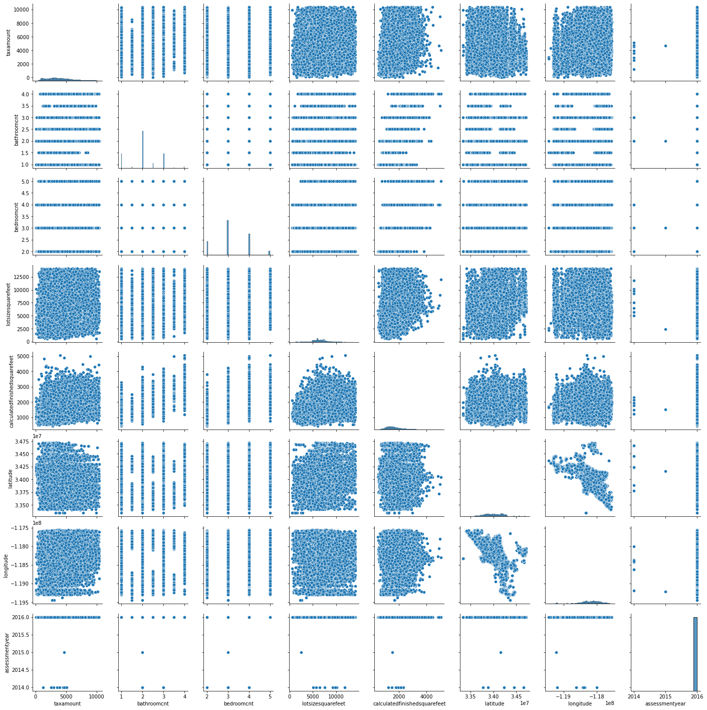

<center><h1>Zillow: What is driving the error is the Zestimates?</h1></center>

<a name ='toc'></a>
# Table of Contents 
1. [Project Planning](#project_planning)
    1. [Project Objectives](#project_objectives)
    2. [Business Goals](#business_goals)
    3. [Audience](#audience)
    4. [Deliverables](#deliverables)
2. [Executive Summary](#exe_sum)
3. [Acquire Data](#acquire)
    1. [Data Dictonary](#data_dict)
    2. [Data Description](#data_desc)
    3. [Acquire Takeaways](#acquire_takeaways)
4. [Prepare Data](#prep_data)
    1. [Distributions](#distributions)
    2. [Prepare Takeaways](#prepare_takeaways)
5. [Data Exploration](#explore)
    1. [Correlations](#correlations)
    2. [Pairplot](#pairplot)
    3. [Explore Takeaways](#explore_takeaways)
6. [Statistical Testing](#stat_testing)
    1. [Hypothesis](#hypothesis)
    2. [Conclusion](#conclusion)
    3. [Takeaway](#stat_takeaway)
7. [Modeling & Evaluation](#modeling)
    1. [Baseline Accuracy](#baseline)
    2. [Minimum Viable Product Model](#mvp)
    3. [Feature Engineering](#feature_eng)
    4. [Hyperparameter Optimization](#hyp_opt)
    5. [Test Best Model](#test_best)
    6. [Create Predictions via CSV](#csv)
    7. [Conclusions & Next Steps](#conclusions)

<hr style="border-top: 10px groove tan; margin-top: 5px; margin-bottom: 5px"></hr>

<a name='project_planning'></a>
## Project Planning
✓ 🟢 **Plan** ➜ ☐ _Acquire_ ➜ ☐ _Prepare_ ➜ ☐ _Explore_ ➜ ☐ _Model_ ➜ ☐ _Deliver_

<a name='project_objectives'></a>
### Project Objectives 
> - For this project you will continue working with the zillow dataset. Continue to use the 2017 properties and predictions data for single unit / single family homes.
> - In addition to continuing work on your previous project, you should incorporate clustering methodologies on this project.
> - Any abstracted modules that are created to make the presentation more clean, during the acquistion and preparation of data.
> - The presentation will consist of a notebook demo of the discoveries you made and work you have done related to uncovering what the drivers of the error in the zestimate is.

<a name='business_goals'></a>
### Business Goals 
> - Create models that are better at predicting property values than the baseline.
> - Demonstrate model effeciency utilizing hyperparameters and different algorithms to estimate price.
> - Document your process well enough to be presented or read like a report.

<a name='audience'></a>
### Audience 
> - Your audience for this project is a data science team. 
<a name='deliverables'></a>
### Deliverables
> - A clearly named final notebook. This notebook will be what you present and should contain plenty of markdown documentation and cleaned up code.
> - A README that explains what the project is, how to reproduce you work, and your notes from project planning.
> - A Python module or modules that automate the data acquisistion and preparation process. These modules should be imported and used in your final notebook.

<div style="text-align: right"><a href='#toc'>Table of Contents</a></div>
<hr style="border-top: 10px groove tan; margin-top: 1px; margin-bottom: 1px"></hr>

<a name='exe_sum'></a>
## Executive Summary
> - 

<div style="text-align: right"><a href='#toc'>Table of Contents</a></div>
<hr style="border-top: 10px groove tan; margin-top: 1px; margin-bottom: 1px"></hr>

<a name='acquire'></a>
## Acquire Data
✓ _Plan_ ➜ 🟢 **Acquire** ➜ ☐ _Prepare_ ➜ ☐ _Explore_ ➜ ☐ _Model_ ➜ ☐ _Deliver_

<a name='data_dict'></a>
### Data Dictionary

| Target                | Datatype               | Definition   |
|:----------------------|:-----------------------|:-------------|
| churn                 | 7043 non-null: object  |describes if the customer has churned|


| Feature               | Datatype               | Definition   |
|:----------------------|:-----------------------|:-------------|
| customer_id           | 7043 non-null: object  |unique customer identifier|
| gender                | 7043 non-null: object  |identifies customer gender|
| senior_citizen        | 7043 non-null: int64   |describes if customer is senior citizen|
| partner               | 7043 non-null: object  |describes if customer has a partner|
| dependents            | 7043 non-null: object  |describes if customer has dependents|
| tenure                | 7043 non-null: int64   |quantifies length of serivce from customer|
| phone_service         | 7043 non-null: object  |describes if customer has phone service|
| multiple_lines        | 7043 non-null: object  |describes if customer has multiple phone lines|
| online_security       | 7043 non-null: object  |describes if customer has online security|
| online_backup         | 7043 non-null: object  |describes if customer has online backup|
| device_protection     | 7043 non-null: object  |describes if customer has device protection|
| tech_support          | 7043 non-null: object  |describes if customer has tech support|
| streaming_tv          | 7043 non-null: object  |describes if customer has tv streaming|
| streaming_movies      | 7043 non-null: object  |describes if customer has movie streaming|
| paperless_billing     | 7043 non-null: object  |describes if customer uses paperless billing|
| monthly_charges       | 7043 non-null: float64 |quantifies average monthly charges|
| total_charges         | 7043 non-null: object  |quantifies all charges for customer|
| contract_type         | 7043 non-null: object  |describes customer contract type|
| internet_service_type | 7043 non-null: object  |describes customer internet service type|
| payment_type          | 7043 non-null: object  |describes customer service payment type|


<a name='data_desc'></a>
### Data Description

|                       |   count |        mean |         std |   min |    25% |     50% |     75% |     max |
|:----------------------|--------:|------------:|------------:|------:|-------:|--------:|--------:|--------:|
| gender                |    7043 |    0.504756 |    0.500013 |  0    |   0    |    1    |    1    |    1    |
| senior_citizen        |    7043 |    0.162147 |    0.368612 |  0    |   0    |    0    |    0    |    1    |
| partner               |    7043 |    0.483033 |    0.499748 |  0    |   0    |    0    |    1    |    1    |
| dependents            |    7043 |    0.299588 |    0.45811  |  0    |   0    |    0    |    1    |    1    |
| tenure                |    7043 |   32.3711   |   24.5595   |  0    |   9    |   29    |   55    |   72    |
| phone_service         |    7043 |    0.903166 |    0.295752 |  0    |   1    |    1    |    1    |    1    |
| multiple_lines        |    7043 |    0.615505 |    0.656039 |  0    |   0    |    1    |    1    |    2    |
| online_security       |    7043 |    0.720006 |    0.796885 |  0    |   0    |    1    |    1    |    2    |
| online_backup         |    7043 |    0.77822  |    0.778472 |  0    |   0    |    1    |    1    |    2    |
| device_protection     |    7043 |    0.777226 |    0.778826 |  0    |   0    |    1    |    1    |    2    |
| tech_support          |    7043 |    0.723555 |    0.795896 |  0    |   0    |    1    |    1    |    2    |
| streaming_tv          |    7043 |    0.817691 |    0.763212 |  0    |   0    |    1    |    1    |    2    |
| streaming_movies      |    7043 |    0.821241 |    0.761725 |  0    |   0    |    1    |    1    |    2    |
| paperless_billing     |    7043 |    0.592219 |    0.491457 |  0    |   0    |    1    |    1    |    1    |
| monthly_charges       |    7043 |   64.7617   |   30.09     | 18.25 |  35.5  |   70.35 |   89.85 |  118.75 |
| total_charges         |    7043 | 2279.73     | 2266.79     |  0    | 398.55 | 1394.55 | 3786.6  | 8684.8  |
| churn                 |    7043 |    0.26537  |    0.441561 |  0    |   0    |    0    |    1    |    1    |
| contract_type         |    7043 |    1.30953  |    0.833755 |  0    |   1    |    2    |    2    |    2    |
| internet_service_type |    7043 |    0.872923 |    0.737796 |  0    |   0    |    1    |    1    |    2    |
| payment_type          |    7043 |    1.66193  |    1.16332  |  0    |   1    |    2    |    3    |    3    |


<a name='acquire_takeaways'></a>
### Acquire Takeaways
> - Wrote a SQL query to acquire telco from Codeup Database.
> - Using `acquire.py` we will create and cache the created CSV file if it doesn't exist, otherwise it will return the file.
> - There are 7043 rows and 21 columns within the inital data query.
> - The `customer_id`column doesn't offer any insight into customer churn, as each observation contains a unique id, so we will drop this column.

<div style="text-align: right"><a href='#toc'>Table of Contents</a></div>
<hr style="border-top: 10px groove tan; margin-top: 1px; margin-bottom: 1px"></hr>

<a name='prep_data'></a>
## Prepare Data
✓ _Plan_ ➜ ✓ _Acquire_ ➜ 🟢 **Prepare** ➜ ☐ _Explore_ ➜ ☐ _Model_ ➜ ☐ _Deliver_

<a name='distributions'></a>
### Distributions


<a name='prepare_takeaways'></a>
### Prepare Takeaways
> - The column `total_charges` was formatted as a string (object) and needed to be as a float 64, there were 11 values that were blank. However, upon further inspection we could see that these were the ones with 0 tenure, meaning they were new customers and hadn't incurred a monthly bill yet, so I put their values to be 0.
> - The distrubtion of `tenure` appears to be mostly uniformly distributed.
> - `total_charges` has a J-shaped distribution.
> - `monthly_charges` appears to have a biomodal distrubtion.
> - Those who `churn` compose about 25% of the data.
> - Data has been split into train, validate, and test datasets, stratifying my `churn` column.
> - I changed the values for all non-int based columns into 1's and 0's so they could be used within the ML modeling. Below is the replacement key:

```python
replacement_key = {
    'gender': {'Female': 0, 'Male': 1},
    'partner': {'Yes': 1, 'No': 0},
    'dependents': {'Yes': 1, 'No': 0},
    'phone_service': {'Yes': 1, 'No': 0},
    'multiple_lines': {'Yes': 1, 'No': 0, 'No phone service': 2},
    'online_security': {'Yes': 1, 'No': 0, 'No internet service': 2},
    'online_backup': {'Yes': 1, 'No': 0, 'No internet service': 2},
    'device_protection': {'Yes': 1, 'No': 0, 'No internet service': 2},
    'tech_support': {'Yes': 1, 'No': 0, 'No internet service': 2},
    'streaming_tv': {'Yes': 1, 'No': 0, 'No internet service': 2},
    'streaming_movies': {'Yes': 1, 'No': 0, 'No internet service': 2},
    'paperless_billing': {'Yes': 1, 'No': 0},
    'churn': {'Yes': 1, 'No': 0},
    'contract_type': {'Two year': 0, 'One year': 1, 'Month-to-month': 2},
    'internet_service_type': {'DSL': 0, 'Fiber optic': 1, 'None': 2},
    'payment_type': {'Mailed check': 0, 'Credit card (automatic)': 1,
                     'Bank transfer (automatic)': 2, 'Electronic check': 3}
```

                     
<div style="text-align: right"><a href='#toc'>Table of Contents</a></div>
<hr style="border-top: 10px groove tan; margin-top: 1px; margin-bottom: 1px"></hr>


<a name='explore'></a>
## Explore Data
✓ _Plan_ ➜ ✓ _Acquire_ ➜ ✓ _Prepare_ ➜ 🟢 **Explore** ➜ ☐ _Model_ ➜ ☐ _Deliver_

<a name='correlations'></a>
### Correlations


#### Correlations of Logerror
|  Column Name |     logerror |
|:-----------------------------|-------------:|
| bathroomcnt                  |  0.00474117  |
| id                           |  0.00447373  |
| regionidcounty               |  0.00292009  |
| rawcensustractandblock       |  0.00269419  |
| fips                         |  0.00269152  |
| roomcnt                      |  0.00199583  |
| latitude                     |  0.00182852  |
| bedroomcnt                   |  0.00125381  |
| calculatedfinishedsquarefeet | -0.000362524 |
| regionidzip                  | -0.000494803 |
| propertylandusetypeid        | -0.00150166  |
| lotsizesquarefeet            | -0.00249514  |
| assessmentyear               | -0.00295415  |
| longitude                    | -0.00302902  |
| landtaxvaluedollarcnt        | -0.00305275  |
| regionidcity                 | -0.00402482  |
| taxamount                    | -0.0042753   |
| taxvaluedollarcnt            | -0.00445937  |
| structuretaxvaluedollarcnt   | -0.00542311  |
| yearbuilt                    | -0.00712105  |

<a name='pairplot'></a>
### Pair Plot


<a name='explore_takeaways'></a>
### Explore Takeaways
> - Examining the correlation between `churn` and each column, we can see that `contract_type`, `tenure`, `online_security`, `tech_support`, `online_backup`, `device_protection`, `device_protection`, `payment_type` are the some of the most correlated columns. 
> - Feeding all columns into my models and seeing which one will be the most accurate seems the best course of action, particularly using combinatorics to determine the best performing model.

<div style="text-align: right"><a href='#toc'>Table of Contents</a></div>
<hr style="border-top: 10px groove tan; margin-top: 1px; margin-bottom: 1px"></hr>

<a name='hypothesis'></a>
### Hypothesis 1 Correlation Test `logerror` vs `id`
> - ${H}_{0}$: There is no correlation between `logerror` and `id`
> - ${H}_{a}$: There is a correlation between `logerror` and `id`

__r-value__: 0.00177

__p-value__: 0.76129

We fail to reject null hypothesis. There is no relationship between `logerror` and `id`

### Hypothesis 2 Correlation Test `logerror` vs `bathroomcnt`
> - ${H}_{0}$: There is no correlation between `logerror` and `bathroomcnt`
> - ${H}_{a}$: There is a correlation between `logerror` and `bathroomcnt`

__r-value__: 0.00354

__p-value__: 0.54214

We fail to reject null hypothesis. There is no relationship between `logerror` and `bathroomcnt`

### Hypothesis 3 Correlation Test `logerror` vs `bedroomcnt`
> - ${H}_{0}$: There is no correlation between `logerror` and `bedroomcnt`
> - ${H}_{a}$: There is a correlation between `logerror` and `bedroomcnt`

__r-value__: 0.00261

__p-value__: 0.65306

We fail to reject null hypothesis. There is no relationship between `logerror` and `bedroomcnt`

### Hypothesis 4 Correlation Test `logerror` vs `calculatedfinishedsquarefeet`
> - ${H}_{0}$: There is no correlation between `logerror` and `calculatedfinishedsquarefeet`
> - ${H}_{a}$: There is a correlation between `logerror` and `calculatedfinishedsquarefeet`

__r-value__: 0.00126

__p-value__: 0.82831

We fail to reject null hypothesis. There is no relationship between `logerror` and `calculatedfinishedsquarefeet`


<a name='modeling'></a>
## Modeling & Evaluation
✓ _Plan_ ➜ ✓ _Acquire_ ➜ ✓ _Prepare_ ➜ ✓ _Explore_ ➜ 🟢 **Model** ➜ ☐ _Deliver_

<a name='delivery'></a>
## Project Delivery
✓ _Plan_ ➜ ✓ _Acquire_ ➜ ✓ _Prepare_ ➜ ✓ _Explore_ ➜ ✓ _Model_ ➜ 🟢 **Deliver**


<a name='conclusions'></a>
## Conclusions & Next Steps

> - I found that most of the models weren't to different in their accuracy, even with hyperparameter optimization and feature engineering.
> - If I had more time to work on this project, I'd continue doing more feature engineering and hyperparameter optmization. 

<div style="text-align: right"><a href='#toc'>Table of Contents</a></div>
<hr style="border-top: 10px groove tan; margin-top: 1px; margin-bottom: 1px"></hr>